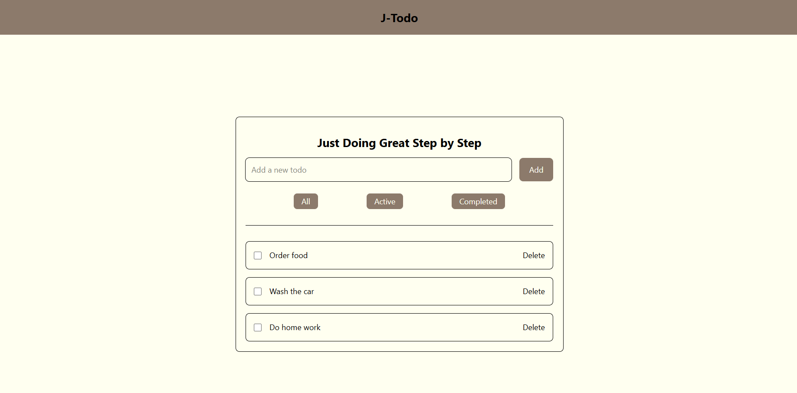

# A Simple Todo List App using Vanilla JS + LocalStorge

I created this to-do list project as part of my learning journey.

## Tech Stack I use:
1. HTML, CSS and vanilla Javascript
2. LocalStorage
3. Fetch with Async Await
4. Tailwind CSS

### Status: Work in progress — part of learning roadmap

